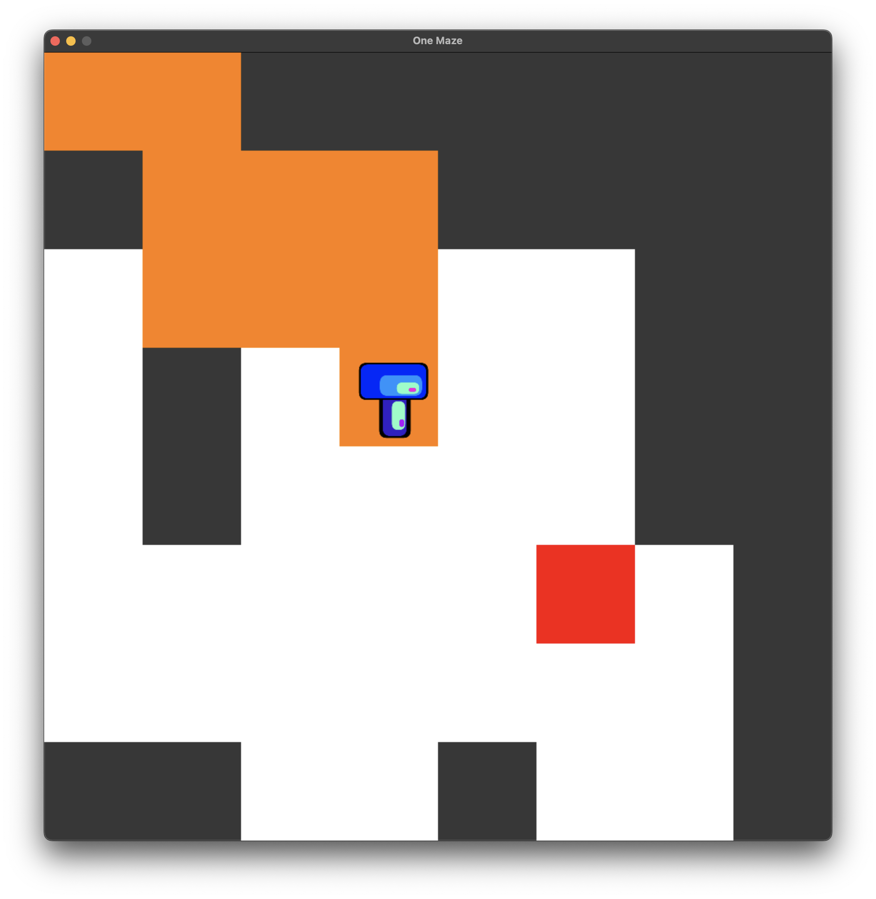

# One Mazer

This is a simple Python game in which you need to fill all white blocks exactly once, not less, not more!

You should finish at the red square, but that's not mandatory, it's just easier this way!



## Requirements

```commandline
python3
pygame
```

### License

This software is under the MIT License. See LICENSE.txt file for more information.